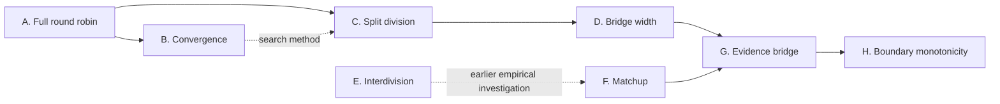

# Toy Elo

`toy_elo` is a sequence of controlled experiments about rating systems on
incomplete comparison graphs.

The motivating question is:

> Can Elo recover a common latent skill scale when most comparisons are local
> to a division and only a sparse set of bouts connects the divisions?

This is research code rather than a single production library. Some ideas
already have packages (`matchup` and `interdivision`); the other experiments
currently live as modules in this directory. The diagram below describes the
ideas and their relationships, not the present filesystem layout.

## Map Of The Research



This is a directed acyclic graph rather than a single chain.

The upper branch develops increasingly incomplete toy comparison graphs:

```text
full round robin -> split divisions -> artificial bridge -> evidence-shaped bridge
```

The lower branch studies real scheduled torikumi:

```text
interdivision -> matchup -> evidence-shaped bridge
```

The branches meet at the evidence bridge. Historical scheduling evidence
determines the shape of the bridge used in an otherwise controlled toy model.
Convergence is shown separately because it is experimental methodology reused
across models, rather than another kind of schedule.

Boundary monotonicity then applies that evidence-shaped graph to the empirical
question raised by `clean_elo`: can strictly declining latent skill produce an
upturn in recovered Elo near the lower edge of the top division?

## A. Full Round Robin

The baseline experiment creates a fixed, evenly spaced latent skill vector.
Every player meets every other player once per event. Bout outcomes are sampled
from the same logistic probability family that the Elo updater uses, while all
observed ratings begin at a common midpoint.

This is intentionally a correctly specified closed world. Its purpose is to
check that the implementation can recover the hidden rating-gap structure
under favourable conditions. It is not evidence that real sumo is generated
by Elo.

Relevant files:

- `elo.py`: expected-score and zero-sum rating updates.
- `model.py`: model parameters and the hidden skill vector.
- `simulation.py`: individual and ensemble round-robin simulations.
- `metrics.py`: pairwise gap RMSE and stability measurements.
- `cli.py`, `tables.py`, and `toy_elo_simulation.py`: the runnable experiment
  and its CSV output.

Run from the repository root:

```console
python -m src.analysis.toy_elo.toy_elo_simulation
```

## B. Convergence

A fixed-K Elo rating in one stochastic run does not settle permanently.
Consequently, these experiments distinguish a noisy sample run from the mean
of many independently seeded runs.

The principal error measure is RMSE across all pairwise rating gaps. A result
is called stable when:

1. ensemble-mean gap RMSE is within a chosen tolerance;
2. its recent slope is sufficiently small; and
3. those conditions hold for a complete stability window.

The convergence tools search for the first event satisfying that rule across
different population sizes. Runtime benchmarking and a quadratic fit are used
to make large searches practical; the quadratic is a search heuristic, not a
claimed law.

Relevant files:

- `convergence_sweep.py`
- `predictive_convergence_sweep.py`
- `benchmark_runtime.py`
- `runtime_model.py`
- `fit_quadratic.py`
- `files/full_round_robin_convergence_20260706_101659.csv`

## C. Split Division

The next experiment divides the ordered population into two skill-contiguous
round robins with no cross-division bouts.

Each division can recover its internal skill gaps. The offset between the two
rating scales, however, is not identified by any result: adding a constant to
every rating in one disconnected component changes no predicted probability
inside that component.

This is the central incomplete-comparison problem. Good local ratings do not
by themselves imply a globally comparable scale.

Relevant file:

- `split_division_sweep.py`

Run:

```console
python -m src.analysis.toy_elo.split_division_sweep
```

## D. Bridge Width

The artificial bridge experiment connects the divisions by rewiring selected
internal bouts into cross-division bouts. The bridge width is expressed as a
percentage of each division near the boundary.

The rewiring preserves per-player match counts. This isolates connectivity as
far as practical: a bridged schedule does not succeed merely because its
players receive more observations.

The experiment measures both internal recovery and whether the bridge learns
the otherwise unidentified division offset. Tested synthetic cases suggest
that a sparse bridge can make the two rating scales commensurate.

Relevant files:

- `bridge.py`: bridge schedule, simulation, and bridge-specific metrics.
- `bridge_width_sweep.py`: incremental convergence search and reporting.

Run:

```console
python -m src.analysis.toy_elo.bridge_width_sweep
```

## E. Interdivision

`interdivision` is an earlier empirical investigation of how often scheduled
bouts cross adjacent division boundaries. It summarizes historical bridge
frequency by division boundary.

It belongs to the empirical branch of the diagram. It does not simulate Elo
and is not directly imported by the toy models.

Relevant package:

- `interdivision/`

Run:

```console
python -m src.analysis.toy_elo.interdivision
```

## F. Matchup

`matchup` is the richer empirical scheduling analysis. It reads historical
scheduled torikumi and counts matchups by day, rank grouping, division, and
distance from an adjacent division boundary.

It writes count and probability matrices, bridge-reach distributions, boundary
distributions, and HTML plots. It uses scheduled bouts rather than realised
results: its purpose here is to describe who is compared with whom, not who
wins.

The boundary distribution produced by this package is the evidence input to
the evidence bridge.

Relevant package:

- `matchup/`

Run:

```console
python -m src.analysis.toy_elo.matchup
```

By default, outputs are written below:

```text
files/output/toy_elo_matchup/
```

## G. Evidence Bridge

The evidence bridge is where the two branches of the diagram join.

It retains the controlled fixed-skill toy world, but replaces the arbitrary
bridge-width parameter with bridge propensities measured by `matchup`. The
default model has a 42-player upper division, a 28-player lower division, and
15 scheduling days per event. Candidate players are represented by distance
from the division boundary rather than historically contingent literal ranks.

The model samples bridge bouts from the empirical profile and fills the
remaining schedule with within-division pairings. It then asks the same
question as the artificial bridge experiment: does this comparison graph
allow Elo to recover a commensurate scale?

The current result is that the evidence-aligned Makuuchi-Juryo bridge appears
sufficient in the tested setup. That is a conditional toy-model result, not a
claim that the model captures full torikumi formation.

Relevant file:

- `evidence_bridge.py`

Generate the empirical profile first, then run:

```console
python -m src.analysis.toy_elo.matchup
python -m src.analysis.toy_elo.evidence_bridge
```

By default, simulation outputs are written below:

```text
files/output/toy_elo_evidence_bridge/
```

## H. Boundary Monotonicity

`boundary_monotonicity` is a controlled follow-up to the lower-makuuchi
reversal found by `analysis.clean_elo`.

The experiment fixes a strictly decreasing latent skill vector and compares:

- the evidence-shaped Makuuchi-Juryo scheduler; and
- the same rank-local scheduler with no interdivision bridge.

The lower 14 top-division players are aggregated into seven two-player
boundary groups. These groups are analogous to BP4's side-collapsed ranks but
are labelled by distance from the boundary rather than as literal M12-M18
positions.

The experiment reports the ensemble-mean boundary curve, bootstrap intervals,
isotonic fit, individual-run reversal rates, and the frequency with which a
simulated reversal reaches the historical M12-M18 magnitude after scaling by
Elo q.

Relevant package:

- `boundary_monotonicity/`

Run:

```console
python -m src.analysis.toy_elo.boundary_monotonicity
```

By default, outputs are written below:

```text
files/output/analysis/toy_elo/boundary_monotonicity/
```

See
[Boundary Monotonicity](boundary_monotonicity/README.md)
for the precise measures and limitations.

## What The Experiments Establish

The deliberately narrow current position is:

1. In a stationary toy world generated by the same logistic family used by
   the updater, ensemble-mean Elo ratings recover the hidden gap structure.
2. Disconnected divisions recover their internal spacing but cannot identify
   their relative offset.
3. Sparse cross-division comparisons can identify that offset in the tested
   artificial schedules.
4. A bridge shaped by observed Makuuchi-Juryo scheduling also appears
   sufficient in the tested 42+28 toy setup.
5. In the first 500-event boundary-monotonicity experiment, the
   evidence-shaped bridge substantially compressed the lower top-division Elo
   gradient but left it much steeper than the boundary-aligned historical
   curve. None of 100 runs had an endpoint as flat as history; one had a local
   reversal larger than the q-scaled historical local reversal.

The work does not establish that Elo discovers true sumo ability, that chii
are latent skill stations, or that disagreement with the banzuke demonstrates
bias. Real sumo adds changing populations, absences, promotions, demotions,
rank-local scheduling, record-dependent opponent selection, non-stationary
ability, and many other mechanisms absent here.

The fifth result is conditional on the tested event count and simplified
scheduler. Convergence across event counts has not yet been demonstrated.

## Code Shape

The research graph is clearer than the present module layout. Much of the
upper branch still lives in large root-level scripts, and some general helpers
are defined inside executable sweep modules. A future package refactor could
give the conceptual nodes their own packages:

```text
full_round_robin/
convergence/
split_division/
bridge_width/
evidence_bridge/
boundary_monotonicity/
matchup/
interdivision/
```

Small shared foundations such as `elo.py`, `model.py`, `metrics.py`,
`audit.py`, and `progress.py` can remain at the `toy_elo` root. Before moving
the experiment files, shared metrics and search primitives should be extracted
from the sweep applications so that package dependencies follow the arrows in
the diagram.

## Further Reading

The notes in `docs/` preserve the detailed reasoning and experimental audit
trail:

1. [Baseline Elo Toy Model](docs/Baseline%20Elo%20Toy%20Model.md)
2. [Incomplete Comparison Progress](docs/Incomplete%20Comparison%20Progress.md)
3. [Bridge Width Solver Spec](docs/Bridge%20Width%20Solver%20Spec.md)
4. [Evidence Aligned Bridge Model](docs/Evidence%20Aligned%20Bridge%20Model.md)
5. [What Ratings Might Say About Grand Sumo](docs/What%20Ratings%20Might%20Say%20About%20Grand%20Sumo.md)

The final note contains the most important interpretive and anti-teleological
guardrails.
